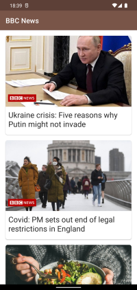
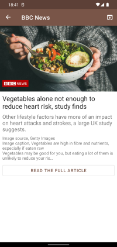
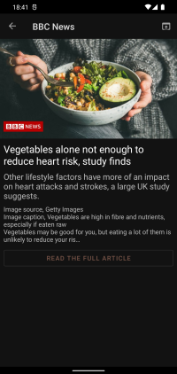
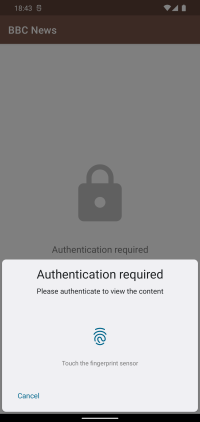
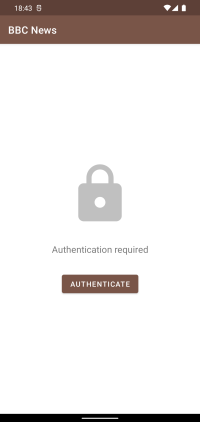
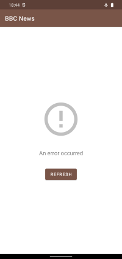
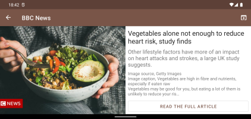

# Critical TechWorks Android Challenge




Android application that displays some top headlines from BBC News.

Made as part of an interview challenge for [Critical TechWorks](https://join.criticaltechworks.com/).

## API Key (IMPORTANT!)

For security reasons, the NewsAPI API Key is not included in the source-code. For the api calls to work, an api key needs to be inserted on `build.gradle`. Replace `API_KEY` with the key on the line:
```kotlin
buildConfigField("String", "NEWSAPI_API_KEY", "\"API_KEY\"")
```

For the app reviewers: I've sent the key along with the links to this project.

For everyone else: You can obtain a free key [here](https://newsapi.org/docs/authentication).

## Tests

This project contains both **Unit** and **Instrumented UI** Tests. These tests do not affect the API call quota since they use "mock"/fake API calls.

**WARNING:** Please disable biometric/fingerprint authentication and it is also recommended that

## Screenshots








## Download

Download the [latest release](https://github.com/trigonated/CTWTopHeadlines/releases/download/v1.0/CTWTopHeadlines-bbcnews-1_0.apk) from the releases page.

Note: You might need to enable [installation of apps from unknown sources](https://www.wikihow.com/Allow-Apps-from-Unknown-Sources-on-Android) before you can install this application.

Note: There are two "flavours" of the app: one with BBC News's content and another with Ars Technica's.

## Building from source

This is a standard gradle project created using Android Studio. Check the [developer guides](https://developer.android.com/guide/) for additional information on how to build projects like this one.
